# How sync works

This page shows the complete sync flow of the Android app, online and offline. It describes the code on `fix/parallel-sync-pull` (PR #32), which adds parallel pull fetches.

Main files:

| Part | File |
|---|---|
| Sync run: push, pull, merge | `mobile/shared/src/commonMain/kotlin/com/habittracker/data/sync/SyncEngine.kt` |
| Server requests and paging | `mobile/shared/src/commonMain/kotlin/com/habittracker/data/sync/PostgrestSupabaseSyncClient.kt` |
| Pull watermarks and pull progress | `mobile/shared/src/commonMain/kotlin/com/habittracker/data/local/SyncWatermarkStore.kt` |
| Background jobs and retry | `mobile/androidApp/src/androidMain/kotlin/com/jktdeveloper/habitto/sync/SyncTriggers.kt`, `SyncWorker.kt` |
| Sign-in, sign-out, session expiry, notifications | `mobile/androidApp/src/androidMain/kotlin/com/jktdeveloper/habitto/AppContainer.kt` |

## 1. The main rule: the phone database comes first

The app reads and writes only the local SQLite database. The screens and the widgets never wait for the server. A sync copies the local changes to Supabase (push), then copies the server changes to the phone (pull).

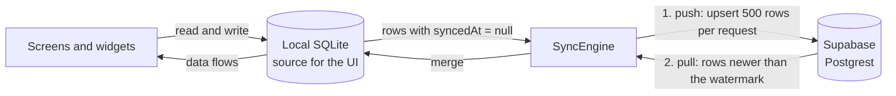

- A local write sets `syncedAt = null`. That marks the row as "not pushed yet".
- A push sends the row and sets `syncedAt` on the phone. The server ignores that time. Its triggers set `synced_at` and `updated_at` to the server time.
- A pull asks only for rows that are newer than the table watermark. Each table has its own watermark.

## 2. What starts a sync

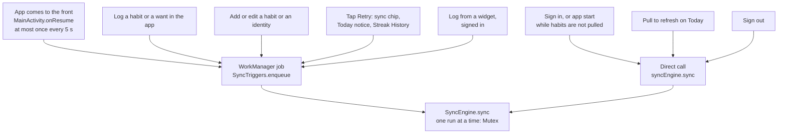

| Trigger | Reason | Path | Retry on failure |
|---|---|---|---|
| App comes to the front | `APP_FOREGROUND` | WorkManager | Yes |
| Log a habit or a want, edit a habit or an identity | `POST_LOG` | WorkManager | Yes |
| Tap Retry | `MANUAL` | WorkManager | Yes |
| Pull to refresh | `MANUAL` | Direct | No |
| Sign in | `POST_SIGN_IN` | Direct, in the app scope | No |
| Sign out | `MANUAL` | Direct, before the local data is cleared | No |
| Log from a widget, signed in | `WIDGET_WRITE` | WorkManager | Yes |

WorkManager job rules:

- Each reason has one unique job name, for example `sync-post-log`. The policy is `KEEP`. While a job for a reason waits or runs, a new request for the same reason is dropped. The job that waits pushes all the pending rows when it runs.
- A `MANUAL` job runs at once, also offline, so the user sees "No network". All other jobs have the constraint `NetworkType.CONNECTED`. Offline, they wait, and WorkManager starts them when the network connects. A job that waits does not count as a sync failure.
- The retry backoff is exponential. It starts at 30 s and doubles each time, up to the WorkManager limit of 5 hours. A retry also waits for the network.
- A widget log only puts a job in the queue. Android delivers widget taps one at a time, so the tap does not wait for the sync.
- An `IllegalStateException` stops the job with no retry. Every other error asks for a retry.

## 3. One sync run, online

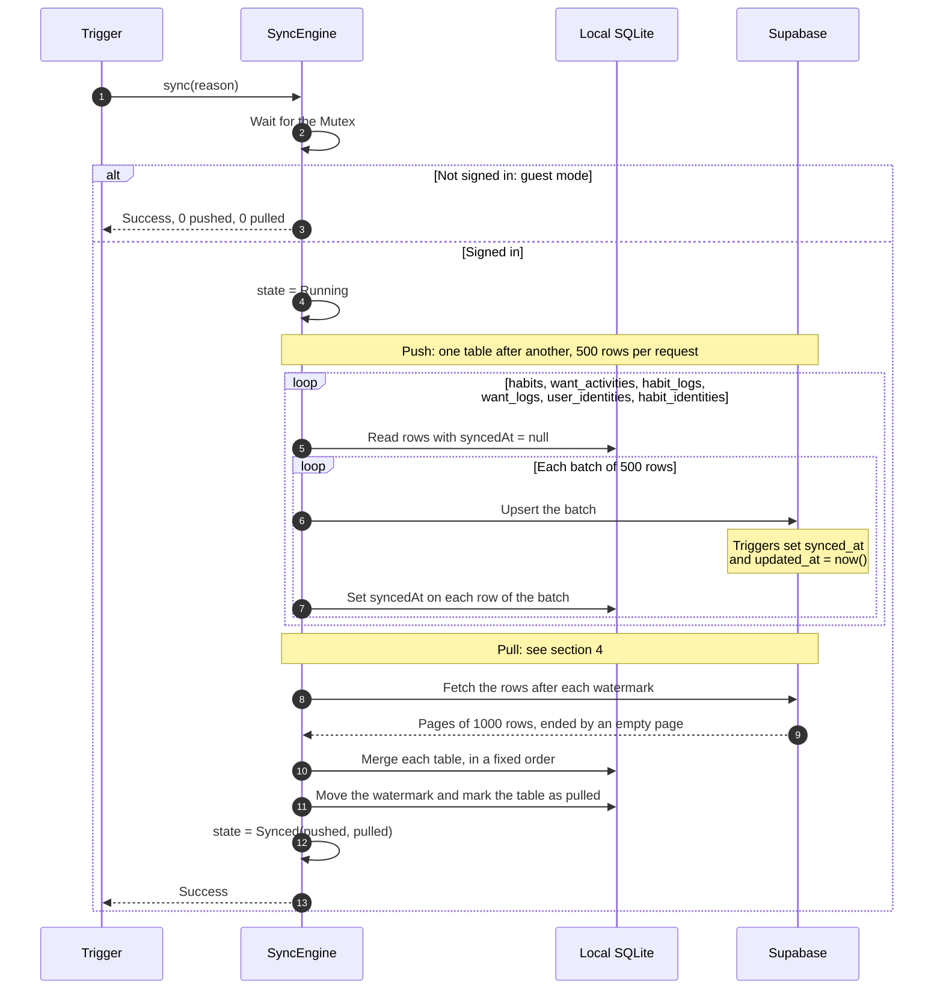

The push comes before the pull. Then the pull cannot replace a local change that is not on the server yet.

## 4. The pull stages

The pull fetches the tables in parallel. It merges them one at a time, in a fixed order: habits before habit_identities, so each link has its habit.

### First pull on this device

The first pull has two stages. The Today screen fills in as each stage is merged.

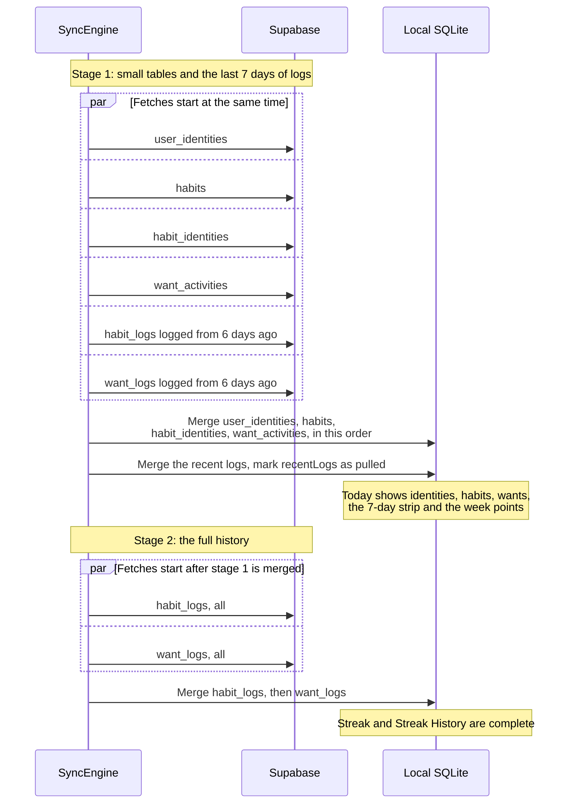

- Stage 2 waits for stage 1, so the large history does not slow the data that Today needs first.
- The recent logs move no watermark. Stage 2 pulls the same rows again. The merge replaces rows by id, so the second copy is safe.
- After each merge, the table goes into `pullProgress`. Today and Streak History use `pullProgress` to show skeletons or data.
- `seedLocalDataIfEmpty` waits until `want_activities` is pulled. Then it adds the seed wants that the user does not have yet.

### Later pulls

Every table is already pulled, so all 6 fetches start at the same time. Each fetch asks only for rows after its watermark.

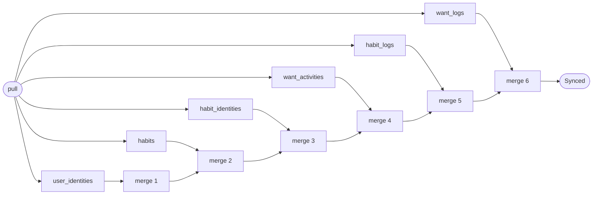

A fetch that ends early still waits for its turn to merge.

### Requests in series

| Sync | Before PR #32 | After PR #32 | Time at 0.3 s per request |
|---|---|---|---|
| First sync, small account | 16 | 4 | about 5 s → about 1.2 s |
| Routine sync, no changes | 6 | 1 | about 2 s → about 0.3 s |

A table with new rows costs 2 requests: one page of rows and one empty page. A table with no new rows costs 1 request.

### Merge rules

| Table | Rule |
|---|---|
| habits, want_activities | The server row replaces the local row only when the server `updatedAt` is newer. |
| habit_logs, want_logs | The server row replaces the local row with the same id. |
| user_identities, habit_identities | The server row replaces the local row with the same key. |

### Watermarks

| Table | Watermark column |
|---|---|
| habits, want_activities, habit_identities | `updated_at` |
| habit_logs, want_logs | `synced_at` |
| user_identities | none: each pull gets all the rows of the user |

The server sets each watermark column. A `before insert or update` trigger writes `now()`, and replaces the time that the app sends (#35). So all the watermarks come from one clock, also for an old version of the app.

A pull asks for rows after the watermark less 5 s (`WATERMARK_OVERLAP_MS`). `now()` is the start time of a transaction. A transaction that commits after the pull of another device can have a time below the watermark of that pull. The next pull asks for those seconds again. The merges are by id, so a row that comes again changes nothing. The watermark only moves forward.

The watermark is in milliseconds, and `now()` has microseconds. The watermark rounds down, so the rows of its last millisecond come again. This direction never loses a row.

Each page starts after the key of the last row read: the watermark column, then `id`. The `id` breaks ties between rows with the same timestamp. Thus no row is lost or read twice at a page boundary.

## 5. Offline

### Writes while offline

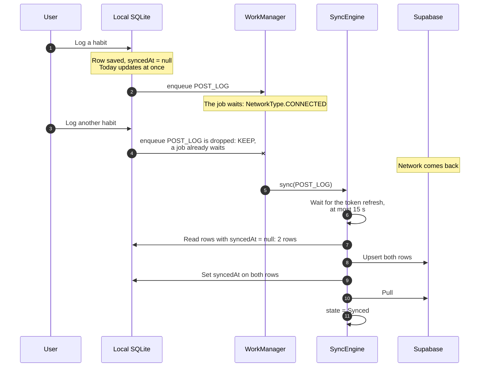

- The app works with no network. All the data on the screens comes from the phone.
- A job that ColorOS stops counts as one attempt, and the next attempt waits for the backoff. With `KEEP`, a new log joins that job, so it also waits for the backoff and not for the network.
- A job waits for a network connection, not for a server that answers. If the server is down, the job runs, fails, counts as a sync failure, and asks for a retry.
- The failed sync changes no local data. The rows stay pending until a push succeeds.
- A push sends each table in batches of 500 rows. Each batch is one request, so the server saves the whole batch or none of it. When a batch fails, the batches before it stay synced. The next push sends only the rest. An upsert of the same row again is safe.
- A list upsert sends one `columns` list with the keys of all its rows. A row without a key gets NULL in that column. So every DTO field with a default value has `@EncodeDefault`.
- A pull that fails keeps the watermarks of the tables merged before the failure. The failed table and the tables after it keep their old watermarks. The next pull starts from there.

### The life of one row

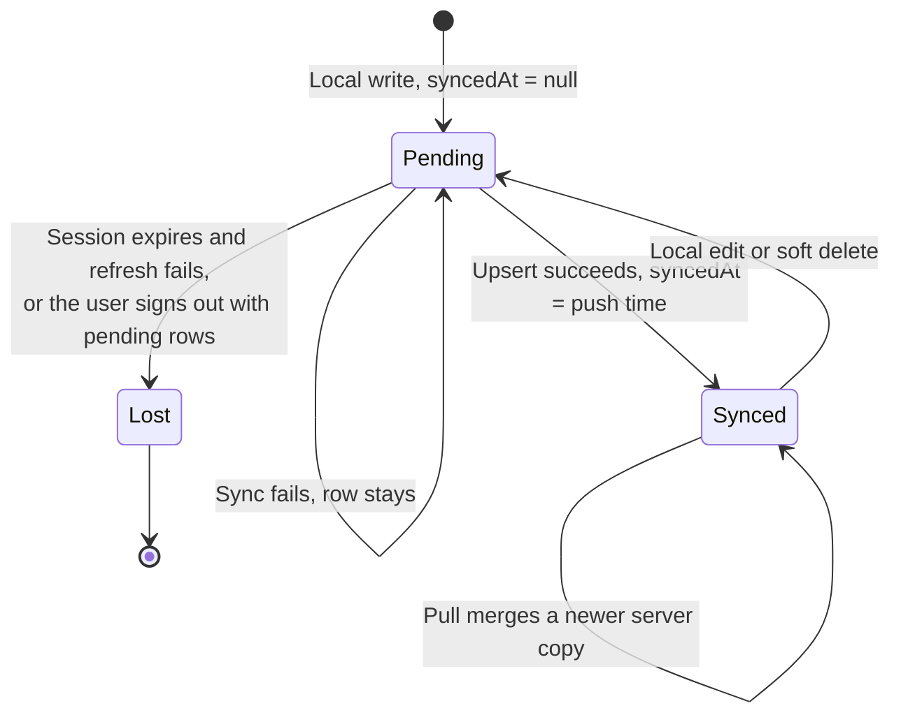

### What the user sees

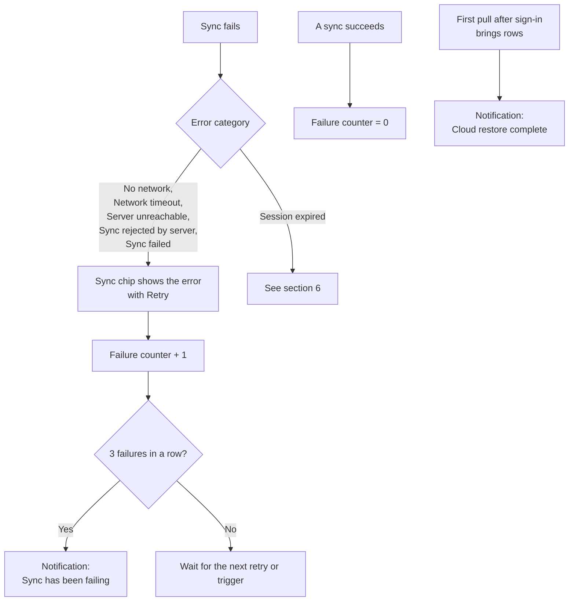

- On a first sync with no network, Today shows skeletons, then a notice with Retry.
- The two notifications need the notification permission. They also need the notification type to be on in Settings.

## 6. Sign in, sign out, and session expiry

### Sign in

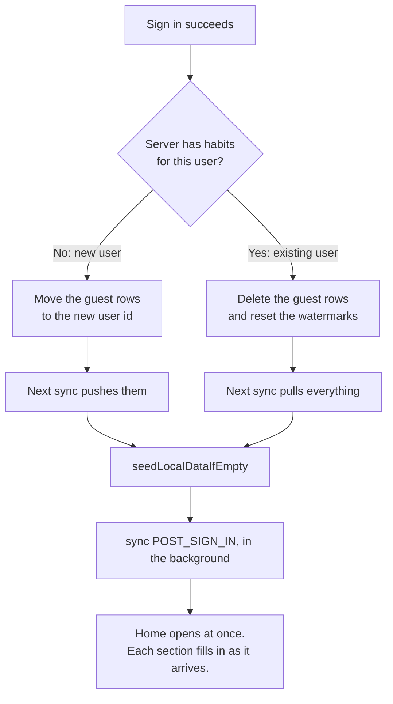

In guest mode, `sync` does nothing. The data stays on the phone until the user signs in.

### Sign out

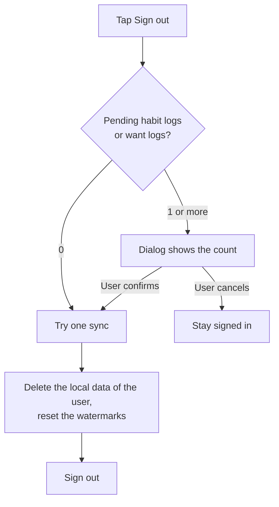

The sync before sign-out can fail, for example offline. The local data is deleted after it anyway.

The Settings screen has the only **Sign out** button. The sync before sign-out stops after 5 s. After the sign-out, the app opens Today for the guest. The sign-out sets the sync state to Idle, so Today for the guest does not show the error of a failed sync.

supabase-kt sends a logout request before it deletes the session on the phone. Offline, that request fails, and supabase-kt keeps the session. So `SupabaseAuthRepository.signOut` then deletes the session on the phone itself. The session on the server stays until its refresh token expires.

### Session expiry

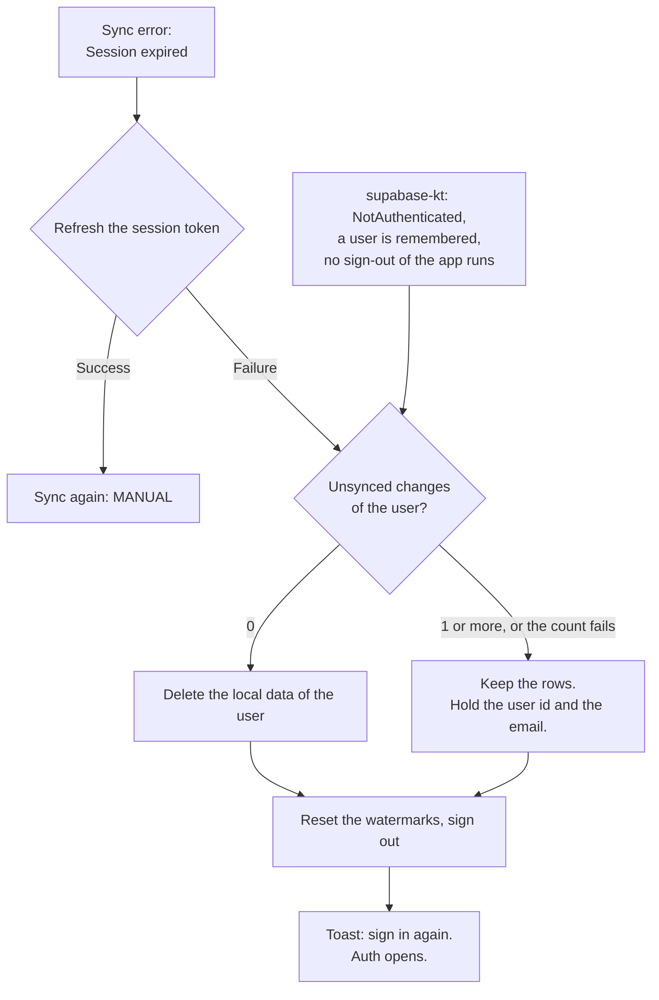

Two guards start this flow:

- **A failed push.** The sync stops with "Session expired". The app tries one refresh. This guard also shows a notification.
- **No session.** supabase-kt deletes the session when the server rejects the refresh. With no unsynced changes, no push fails. So the app also watches for `NotAuthenticated`. This guard also runs at a cold start, when supabase-kt finds no stored session. Without it, the app shows the data of the remembered user to a signed-out phone.

`ServerSessionEnd` tells this end apart from a sign-out of the app. `Initializing` (the app stops) and `RefreshFailure` (the phone is offline) keep the session, so they do not start the flow. A guest has no remembered user, so the flow does not start for a guest.

### Offline refresh

An access token expires after 1 hour. If the phone cannot reach the server at a cold start, supabase-kt cannot refresh the token. It sets `RefreshFailure`, keeps the stored session, and tries again every 10 s.

`currentSessionOrNull()` is null during `RefreshFailure`. So the app does not use it to decide the sign-in state:

| Status | Signed in (`isLoggedIn`) | Requests can run (`awaitSessionReadiness`) |
|---|---|---|
| `Authenticated` | Yes | Yes |
| `RefreshFailure` | Yes | No |
| `Initializing` | No | No |
| `NotAuthenticated` | No | No |

- Today shows the data of the user and no **Sign in** button.
- `SyncEngine` sends no request without a token. A request without a token goes out as anon. The server rejects it with "Unauthorized", and the session guard would then end a valid session. Instead, the sync stops with "Server unreachable", and the job asks for a retry.
- The guard for "Session expired" does nothing while no token exists. A manual refresh would fail at once and end the session.
- When the app goes to the background, supabase-kt sets `Initializing`. At the next start, it refreshes an expired token, and the status stays `Initializing` during the request. So `SyncEngine` waits at most 10 s for a different status before it starts.
- If the status stays `Initializing`, `awaitSessionReadiness` loads the session from storage with `loadFromStorage()`. supabase-kt loads the session only when the app comes to the front, so a background job such as a widget sync needs this.
  - In the foreground, the wait before the load is 10 s, and the wait after it is 10 s. A resume settles in the first 10 s, so the session does not load twice.
  - In the background, the wait before the load is 1 s, and the wait after it is 3 s. ColorOS (OPPO) freezes a background app 5 s after a job starts, and it stops the job. A cold start can then load the session twice and refresh the same token twice at the same time. The server accepts that.
  - Offline, `loadFromStorage()` retries the refresh and does not return. So the load runs beside the wait and stops when the wait ends.
- If the session does not load from storage either, the sync sends no request and keeps its state. The job asks for a retry.
- A process that starts in the background, for a widget tap or a sync job, builds its auth state before supabase-kt loads the session. So `LastAuthUserStore.isSignedIn` counts the remembered user as signed in until the status is `NotAuthenticated`. A sign-out and a session end clear the remembered user.
- During `RefreshFailure`, supabase-kt tries the refresh again every 10 s. A background job waits at most 15 s for that attempt. On a reconnect, the attempt succeeds and the job pushes. A `MANUAL` sync does not wait, so pull to refresh offline shows "Server unreachable" at once. After a load of its own, the job does not wait, because the load stopped and no retry follows.
- When a refresh succeeds after `RefreshFailure`, `sessionRecovered` emits. The app reads the auth state again and starts a sync with `APP_FOREGROUND`. The user does not need to pull to refresh.
- If the server rejects the refresh, supabase-kt sets `NotAuthenticated`. The "No session" guard then ends the session.

### Session end at a cold start

The event stays pending until the navigation consumes it. At a cold start, the guard and the start screen react to the same status. So the navigation runs the guard check before it selects the start screen. If an event is pending, a spinner covers the guest start screen until Auth shows. Thus the guest screen does not show before Auth.

If the guard runs in a background process, such as a widget update, and the process stops, the toast does not show. The app then opens as a guest. The Auth notice still shows any held changes.

The refresh failed, so the app cannot push the unsynced changes. `HeldAccounts` keeps them on the phone for the next sign-in. The kept rows have the user id of the held account, so a guest sees none of them.

The Auth screen shows a notice while the hold exists. The notice shows the count of unsynced changes and the email of the held account. The email comes from `LastAuthUserStore`, because supabase-kt can clear the session before the app reads it.

The next sign-in resolves the hold before the guest migration:

- **Same account:** the app keeps the rows. The first sync pushes them.
- **Another account:** the app deletes the rows of the held account. If the delete fails, the hold stays, and the next sign-in tries again.

## 7. Known risks

- **The overlap pulls the newest rows again.** All the rows of one batch have the same `synced_at`, and the watermark stays at that time until a newer row arrives. Each sync then pulls that batch again: 222 logs are about 60 KB.
- **A cancelled job shows as a failure.** ColorOS can stop a job during a sync. `SyncEngine` then sets the state to "Sync failed", and the failure counter goes up by 1. The next sync that succeeds resets both.
- **Last push wins.** The server sets `updated_at` at the push. An edit that was made offline and pushed later replaces a newer edit from another device.
